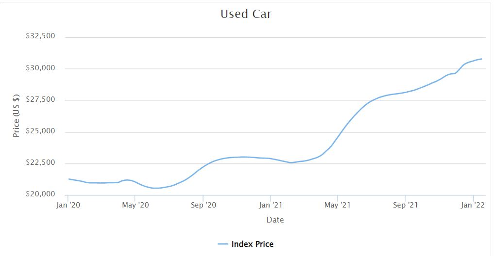
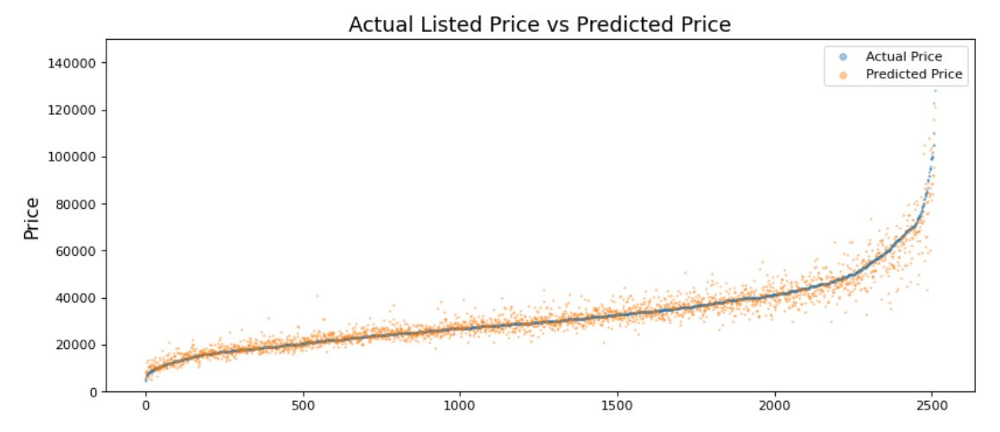
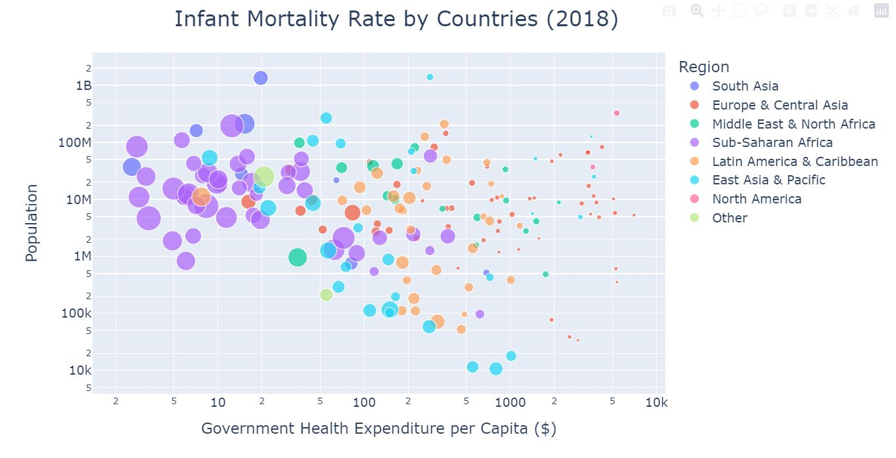
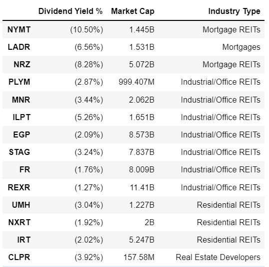
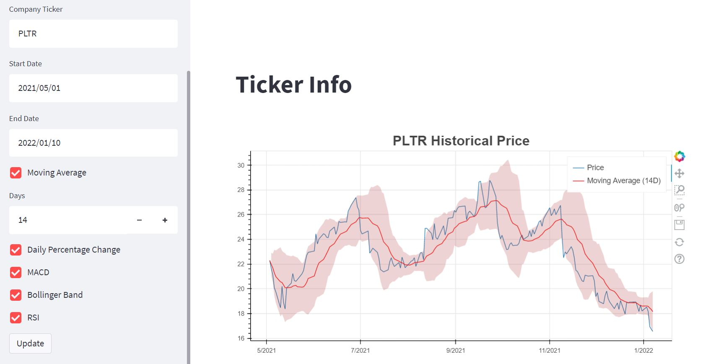

## This is Jae Hun's Portfolio.

This is the list of independent projects I have worked on - Machine Learning, Scraping, Visualization and Application. 
Clicking on the title will direct you to the github repositories.

# ML

## Classification
### [JobCare Materials Usage Prediction](https://github.com/jayhoneylee527/Job-Recommendation-Manual-Usage-Prediction) - DACON Competition ###

[Korea Employment Information Service](http://www.keis.or.kr) operates an AI platform that analyzes job seekers' traits and provides them with proper trainings, consultings and support. In this competition hosted by KEIS, participants are expected to build binary classification models that predict whether people accessing their platform would decide to use the educational materials provided to support their job training.

The notebook on the repository walks through the EDA, feature engineering and model trainings. For the classification models, I experimented with Logistic Regression, Random Forest Classifier, SVC, XGB Classifier, LDA and Catboost Classifier. The Catboost outperformed; in order to boost the performances, I used Optuna library for hyperparameter tuning. My submission placed me on the top 20% of the leader board. 

### [Stock Movement Direction Classifier](https://github.com/jayhoneylee527/Stock_Price_Movement_Prediction) ###

To anticipate stock market is impossible. Stock market (or perhaps any other market where irrationality supercedes rationalitity) is the most whimsical, unpredictable field. 

However, in a vain attempt to build a reliable, or at least a surviving mechanism that barely loses in the market, I have decided to derive several features, those of particular stock and those of commodities and indices that investors often refer to measure the sentiment of the market.

The project consists of feature engineering, model training and back tester, which tells the investors to either buy or sell 5 days prior to the next opening day. The back tester calculates hypothetically how much money would we earn or lose using models. The models used are random forest classifier and neural network. The greatest difficulty was that since observed variables in the past do not follow certain distributions, training on the train set easily overfits. 

## Regression
### [Bulldozer Bluebook - Price Prediction](https://github.com/jayhoneylee527/Bulldozer-Price-Prediction) ### 

The project uses datasets from a previous competition on [Kaggle](https://www.kaggle.com/c/bluebook-for-bulldozers/overview/description), where participants were expected to predict the bluebook prices of bulldozers. 

The most challenging aspect of the project was feature engineering. Some feature columns included erroneous data, while some others had more than 80% missing rows, for which I had to create customized imputation methods that account for different types of missingness. For regression models, I used Random Forest Regressor and XGB Regressor which displayed similar performances. Since this competition ended few years ago, I did not get to observe the model performances of the test data. However, prediction score (Root Mean Squared Logarithmic Error) on the validation set was comparable to the top of leader board.      

### [Used Car Listing Scraper & Price Prediction](https://github.com/jayhoneylee527/Used-Car-Price-Prediction) ###

  

  
  <em>Source: cargurus.com</em>

From the onset of Coronavirus pandemic, the U.S used car market has seen unprecedented rate of increase in the second hand automobiles' prices. The phenomenon is mainly attributed to two reasons: decreased production by automakers due to microchip shortages and increased demand from consumers returning to work. With prices still surging fast, buying a car has become more difficult, as knowing the benchmark price is harder; I decided to build a price predictor, so that it will serve as a criterion for future purchases. 

**The project consists of two parts:**

1) Scraper that gathers listings of used cars on [cargurus.com](https://www.cargurus.com/)

2) Feature Engineering, Model Training & Analysis of the Model Performances

Due to the time & resources limit, the scraper collects information on ~25,000 listed recently on cargurus. The information scraper collects includes car model, mileage, make year, MSRP. color, options included and etc. Nearly 70% of the listings were missing MSRP (suggested retail price) - the most important feature in predicting the current prices. I created a separate MSRP scraper to gather as many MSRP data as possible for each model.   

Based on more than 30 feature columns, I used 4 different regressors. XGB regressor showed the highest precision after parameter tuning.

  

# Scraping & Visualization

### [Health Nutrition and Population Statistics Visualization](https://github.com/jayhoneylee527/Health-Nutrition-and-Population-Statistics-Visualization/tree/main) ###

Is the world becoming better? Especially in the developing regions, do humans now have better chances of survival? By looking at the data from the past six decades, I created several visualizations that display trends on infant mortalities, birth rates, populations by age bracket and etc. Through macroscopic analysis, I have discovered some obvious and some astounding changes that the world has seen recently. 

  

  
### [Stock Dividend Yield Scraper](https://github.com/jayhoneylee527/Stock-Dividend-Yield-Scraper) ###

I am currently investing in stocks, including Real Estate Investment Trusts (REITs). One of the most significant factors I consider when investing in REITs is their dividend yields. Depending on the types of industries the funds invest and their market capital, their profit sharing with the investors vary; I needed to build a simple table that will display list of dividend yields of each company, so that I can compare the returns as an investor and rebalance my portfolio.  

  

  
### [Youtube Sentiment on Korean By-election Scraping](https://github.com/jayhoneylee527/Seoul-Mayor-By-Election-Sentiment-Analysis) ###

April 7th, 2021 was the day of by-election in South Korea. Most notably, it was the day that citizens of Seoul voted for the new mayor of Seoul - in a passage to the presidential election of 2022, for both parties, Democratic and People's party (conservative), the importance of this particular election could not compare to that of any of the previous ones. 

This year in particular, the public saw the prevalence of political opinions & voices on the internet more than ever - even the campaigns were allocating big chunk of their resources to promote their agenda on social media. To measure general public's sentiment to the candidates, I decided to scrape data from YouTube, to observe basic statistics of hundreds of videos uploaded regarding two most prominent candidates. By analyzing the views, likes/dislikes ratio I attempted to visualize and compare the degree of interests (both positive and negatie). 

# Streamlit Application 
###  [FIFA22 Player DB](https://github.com/jayhoneylee527/FIFA22-PlayerDB) ###

As a serious FIFA player (challenge accepted anytime) I have to know the traits of each player to build an ideal team on a career mode. Ideally, I would love to create an All Star team with Messi and Ronaldo. However, it is not only expensive but also in fact, not so economical. The App I created through Streamlit helps users to improve their squads in two ways:

1) Visualize each player's abilities and list other players with similar traits.

2) Filter players by the traits including their abilities, age, market value and etc.  

With this tool, users can find a nice replacement for the world-class player at an affordable market value. [Click here to access the App](https://share.streamlit.io/jayhoneylee527/fifa22-playerdb/main/fifa.py).  

### [Stock Ticker Info & Price Charts](https://github.com/jayhoneylee527/Streamlit-TickerInfo_ARIMA) ###

Based on the ticker symbol and user input date, the app displays price and technical indicator trends over time. Moreover, it provides ARIMA prediction on the future trends of prices. [Click here to access the App](https://share.streamlit.io/jayhoneylee527/streamlit-tickerinfo_arima/main/main.py).

  

